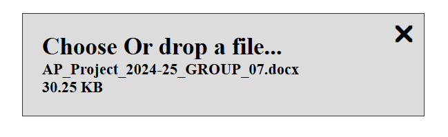

# React-drag-and-drop :blush:

Homepage: https://github.com/Gurjinder7/react-drag-and-drop#readme  :wave:

  ** ***<u>Made with and for React 18</u>*** ** :smile:
### Features:
* Drop a file or choose one
* Set size limits to the files in MBs
* Allow all types of files or a single type of files or a combination! :smirk: 
* See name and size of the file in widget
* Drop a new one to replace or remove the selected file
* Style as per your usage using custom CSS styles
* very light weight


### How to install
```npm i @gurjinder7/react-drag-and-drop```

### How to use in your React project

1. Import into the project (where ever you need the feature)
   1. ```import DragAndDrop from '@gurjinder7/react-drag-and-drop'```
   2. ```import '@gurjinder7/react-drag-and-drop/src/style.css'```
      1. You can import the CSS either in ```App.jsx``` (if you are going to use the component in different components).
      2. You can import the CSS in the component you are importing the widget. 
2. Format for use in JSX
   ```
   <DragAndDrop 
    getFileData={<your_file_receiving_function>}
    id="<some_id>"
    ref={<ref_for_this_element>}
    >
   ```
3. The component will start working for the intended functionality
   1. This will take any file format and size.
   2. **NOTE**: <u>***Adding "id" and "refs" is important to avoid glitches***.</u> :worried:
4. Styling: :star:
   1. you can use custom CSS to style the component
   2. The ```id``` can be used as the container for styling which is basically a for ```<label>``` tag in the component
      1. Then other elements like ```<p>```, ```<span>``` can be styled as well. 
      2. Example: ```label#file123 { background-color: red; }```

### Parameters:
Following are some important information about the parameters, also informs about how you can add restrictions for some use cases.
* **Required**: :point_left:
  * ```getFileData``` - to receive the file object from this component, use event object in the receving function for the file data.
  * ```id``` - to uniquely identify the component in DOM 
  * ```ref``` - to receive ref for the component
* **Optional** :v:
  * ```style``` - you can add your own css classes to overwrite the styling
  * ```size``` - mention a number to limit the file size (in MBs)
    * example: if your write 1, that means size limit of 1 MB.
  * ```accept```- mention any file extension to limit the file type
    * You can do ```accept="png"``` for only allowing ```.png``` file types
      * <i>Rule of thumb is your intended file extension should match the accept value(s)</i>. 
      * <u>Note: don't include dot(.) in the accept values.</u> 
    * You can combine multiple file extensions to allow more than one format
      * ```png/pdf``` or ```jpg/jpeg/png``` or ```docx/pdf``` or ```csv/xlsx``` etc. :point_left:

### Example with optional parameters:

    let fileRef = createRef()

    let fileId = uuid() or "file123

    const getFileDataFromDragAndDrop = (e) => {
        console.log(e)
    }

    <DragAndDrop 
     getFileData={getFileDataFromDragAndDrop}
     id="file123"
     ref={fileRef}
     style="bg-red bg-border"
     size="1"
     accept="pdf/docx"
    >

##### <u>Important Note:</u> :imp:
***Different id and refs is important for multiple instances:*** if you are using more than one instance of the component, otherwise you will experience glitch of file being attached to first instance every time you try to add a file to  any other instance of the component.

#### Report an issues! :cry:
* Please raise an issue on the package repo at: https://github.com/Gurjinder7/react-drag-and-drop/issues